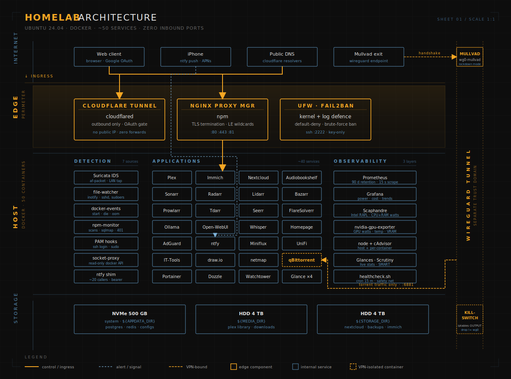
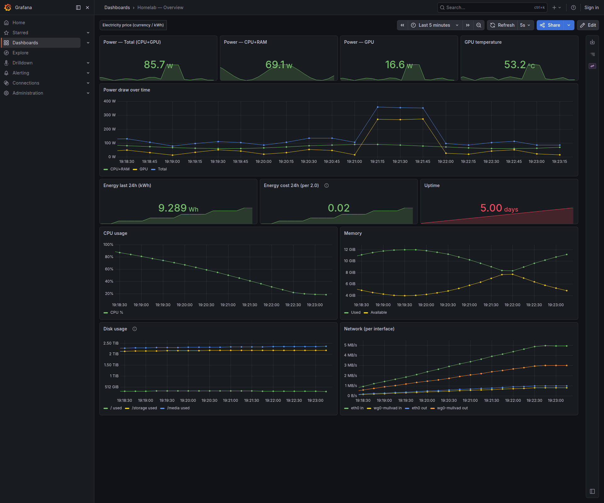

<div align="center">

# Homelab

**Self-hosted infrastructure as code — ~50 Docker services, Prometheus + Grafana power-monitoring, defense-in-depth security, fully reproducible.**

[](https://github.com/MrTorriz/homelab/actions/workflows/lint.yml)
[](LICENSE)
[](https://github.com/MrTorriz/homelab/commits/main)
[](docker/README.md)
[](docs/security.md)

<br/>

[](#)
[](#)
[](#)
[](#)
[](#)
[](#)
[](#)

</div>

---

## TL;DR

- **Defense-in-depth security** — UFW + Suricata IDS + fail2ban + VPN killswitch + zero open ports.
- **Power-aware monitoring** — Prometheus + Grafana + Scaphandre measure real wattage and cost.
- **Event-driven alerting** — ~20 ntfy callers push SSH, sudo, IDS hits to phone in seconds.

<p align="center">
  
</p>

---

## By the numbers

<table align="center">
  <tr>
    <td align="center" width="180"><h2>~50</h2>services</td>
    <td align="center" width="180"><h2>0</h2>inbound ports</td>
    <td align="center" width="180"><h2>90 d</h2>metric retention</td>
    <td align="center" width="180"><h2>22.7k</h2>UFW drops / 7d</td>
  </tr>
</table>

Sourced from [`docs/metrics.md`](docs/metrics.md) — every figure links back to the command or dashboard that produced it.

---

## Stack

### Reverse proxy & access

[](#)
[](#)

### Media

[](#)
[](#)
[](#)
[](#)
[](#)
[](#)
[](#)
[](#)
[](#)

### Photos & files

[](#)
[](#)
[](#)
[](#)

### Local AI

[](#)
[](#)
[](#)

### Network & DNS

[](#)
[](#)

### Security

[](#)
[](#)
[](#)
[](#)
[](#)

### Observability

[](#)
[](#)
[](#)
[](#)
[](#)
[](#)
[-191919?style=flat-square&logoColor=white)](#)
[](#)

### Container management

[](#)
[](#)
[](#)

Full per-service catalogue: [`docker/README.md`](docker/README.md)

---

## Showcase

### Dashboards

<table>
  <tr>
    <td width="50%" align="center">
      <br/>
      <sub><b>Homepage</b> — themed dashboards · live tiles · *arr stack</sub>
    </td>
    <td width="50%" align="center">
      <br/>
      <sub><b>Grafana</b> — power, energy, cost, capacity</sub>
    </td>
  </tr>
</table>

### Tooling demos

<p align="center">
  <table width="75%" align="center">
    <tr>
      <td width="50%" align="center">
        <br/>
        <sub><b>deploy.sh</b> — idempotent rsync with conditional reloads</sub>
      </td>
      <td width="50%" align="center">
        <br/>
        <sub><b>ntfy</b> — event-driven push alerts to phone</sub>
      </td>
    </tr>
  </table>
</p>

---

## Repo layout

```text
.
├── docker/              # Compose stack (~50 services) + .env.example
├── homepage/            # Dashboard config (services + widgets)
├── scripts/             # deploy, healthcheck, backup/, security/, monitoring/, maintenance/, motd/, systemd/
├── security/            # UFW, fail2ban, SSH, hardening checklist
├── docs/                # Architecture, security model, threat model, runbook, DR, cost, decisions
└── .github/workflows/   # CI: shellcheck + yamllint + markdownlint + gitleaks + sanitize-check
```

---

## Setup

```bash
git clone https://github.com/MrTorriz/homelab.git ~/homelab
cd ~/homelab

# 1. Configure
cp docker/.env.example docker/.env
$EDITOR docker/.env

# 2. Bring up the stack
docker network create homelab
cd docker && docker compose up -d

# 3. Apply security baseline
sudo bash ../security/ufw-baseline.sh
sudo bash ../security/install-fail2ban.sh

# 4. Deploy via the same flow on every change
../scripts/deploy.sh
```

> **Note:** set `LAN_IFACE` in `.env` to match your NIC name. `eth0` is a placeholder — modern Ubuntu typically uses `enp*` or `ens*` (check with `ip -br link`).

External access is opt-in — set up a Cloudflare Tunnel and point it at `npm:443` (no router port-forwarding needed).

---

## Documentation

- [`docs/architecture.md`](docs/architecture.md) — How traffic, storage, and trust flow through the system
- [`docs/security.md`](docs/security.md) — Defense-in-depth model + STRIDE analysis
- [`docs/observability.md`](docs/observability.md) — Three-layer model: metrics (Prometheus + Grafana + Scaphandre), events (~20 ntfy callers across 7 security + 13 operational sources), health (healthcheck cron) — [dashboard screenshot](docs/img/grafana-overview.png)
- [`docs/metrics.md`](docs/metrics.md) — What the system actually catches (real numbers)
- [`docs/runbook.md`](docs/runbook.md) — Incident playbooks: what to do at 03:00
- [`docs/disaster-recovery.md`](docs/disaster-recovery.md) — RTO/RPO targets + zero-to-running restore
- [`docs/cost.md`](docs/cost.md) — What it actually costs to run, with receipts
- [`docs/hardware.md`](docs/hardware.md) — Specs, storage layout, GPU role
- [`docs/decisions.md`](docs/decisions.md) — Why these tools and not the alternatives

---

## License

MIT — fork it, copy bits, learn from it.
