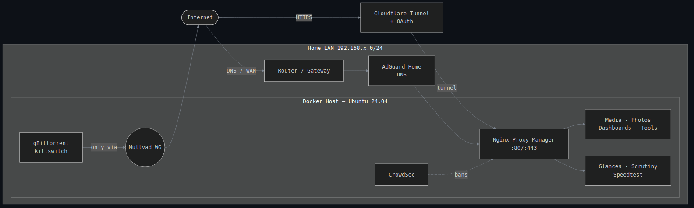
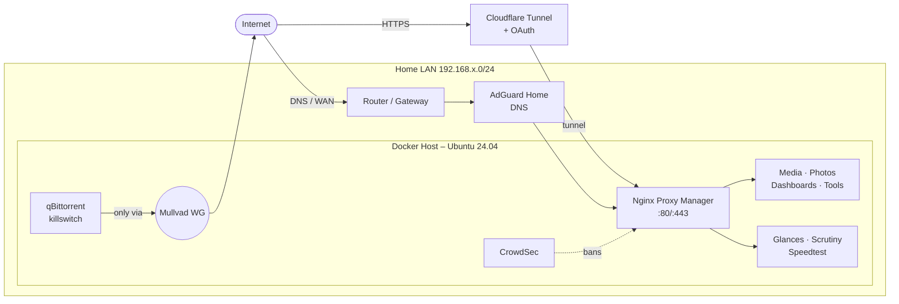

<div align="center">

# Homelab

**Self-hosted infrastructure as code — ~30 Docker services, defense-in-depth security, fully reproducible.**

[](https://github.com/MrTorriz/homelab/actions/workflows/lint.yml)
[](LICENSE)
[](https://github.com/MrTorriz/homelab/commits/main)
[](docker/README.md)
[](docs/security.md)

<br/>

[](#)
[](#)
[](#)
[](#)
[](#)
[](#)
[](#)

</div>

---

## TL;DR

<p align="center">
  
</p>

Single-host homelab on Ubuntu 24.04, ~30 Dockerised services, behind Nginx Proxy Manager and a Cloudflare Tunnel for external access. Everything is reproducible from this repo: clone, set `.env`, `docker compose up -d`.

- **Defense-in-depth:** UFW default-deny, CrowdSec, fail2ban, SSH key-only, `no-new-privileges` on every container, Docker socket proxy, VPN-bound torrent traffic with killswitch.
- **Zero open inbound ports:** external access goes through Cloudflare Tunnel + Google OAuth — the home IP never appears in DNS.
- **Idempotent deploys:** rsync `--checksum` from git → live, conditional service reloads, validation gates on SSH config.
- **Observability:** Glances, Scrutiny (SMART), Speedtest Tracker, healthcheck → ntfy.

---

## Architecture



<details>
<summary>Interactive Mermaid source</summary>



</details>

---

## Stack

<table>
<tr><th>Layer</th><th>Services</th></tr>
<tr><td><b>Reverse proxy</b></td><td>Nginx Proxy Manager · Cloudflare Tunnel</td></tr>
<tr><td><b>Dashboards</b></td><td>Homepage · Glance</td></tr>
<tr><td><b>Media</b></td><td>Plex · Sonarr · Radarr · Lidarr · Bazarr · Prowlarr · qBittorrent · FlareSolverr · Tdarr · Seerr · Audiobookshelf</td></tr>
<tr><td><b>Photos</b></td><td>Immich (server + ML on GPU + Postgres + Redis)</td></tr>
<tr><td><b>Network / DNS</b></td><td>AdGuard Home (LAN-wide DNS + blocking)</td></tr>
<tr><td><b>Security</b></td><td>UFW · fail2ban · CrowdSec · Mullvad WireGuard (lockdown) · SSH key-only · Docker socket proxy</td></tr>
<tr><td><b>Observability</b></td><td>Glances · Scrutiny (SMART) · Speedtest Tracker · custom healthcheck → ntfy</td></tr>
<tr><td><b>Docker mgmt</b></td><td>Portainer · Dozzle · Watchtower</td></tr>
<tr><td><b>Misc</b></td><td>Miniflux · ntfy · IT-Tools · draw.io</td></tr>
</table>

Full per-service catalogue: [`docker/README.md`](docker/README.md)

---

## Repo layout

```
.
├── docker/              # Compose stack (~30 services) + .env.example
├── homepage/            # Dashboard config (services + widgets)
├── scripts/             # deploy, healthcheck, VPN rotation
├── security/            # UFW, fail2ban, SSH, hardening checklist
├── docs/                # Architecture, security model, hardware, decisions
└── .github/workflows/   # CI: shellcheck + yamllint
```

---

## Setup

```bash
git clone https://github.com/MrTorriz/homelab.git ~/homelab
cd ~/homelab

# 1. Configure
cp docker/.env.example docker/.env
$EDITOR docker/.env

# 2. Bring up the stack
docker network create homelab
cd docker && docker compose up -d

# 3. Apply security baseline
sudo bash ../security/ufw-baseline.sh
sudo bash ../security/install-fail2ban.sh

# 4. Deploy via the same flow on every change
../scripts/deploy.sh
```

External access is opt-in — set up a Cloudflare Tunnel and point it at `npm:443` (no router port-forwarding needed).

---

## Documentation

- [`docs/architecture.md`](docs/architecture.md) — How traffic, storage, and trust flow through the system
- [`docs/security.md`](docs/security.md) — Defense-in-depth model + STRIDE analysis
- [`docs/metrics.md`](docs/metrics.md) — What the system actually catches (real numbers)
- [`docs/runbook.md`](docs/runbook.md) — Incident playbooks: what to do at 03:00
- [`docs/hardware.md`](docs/hardware.md) — Specs, storage layout, GPU role
- [`docs/decisions.md`](docs/decisions.md) — Why these tools and not the alternatives

---

## License

MIT — fork it, copy bits, learn from it.
