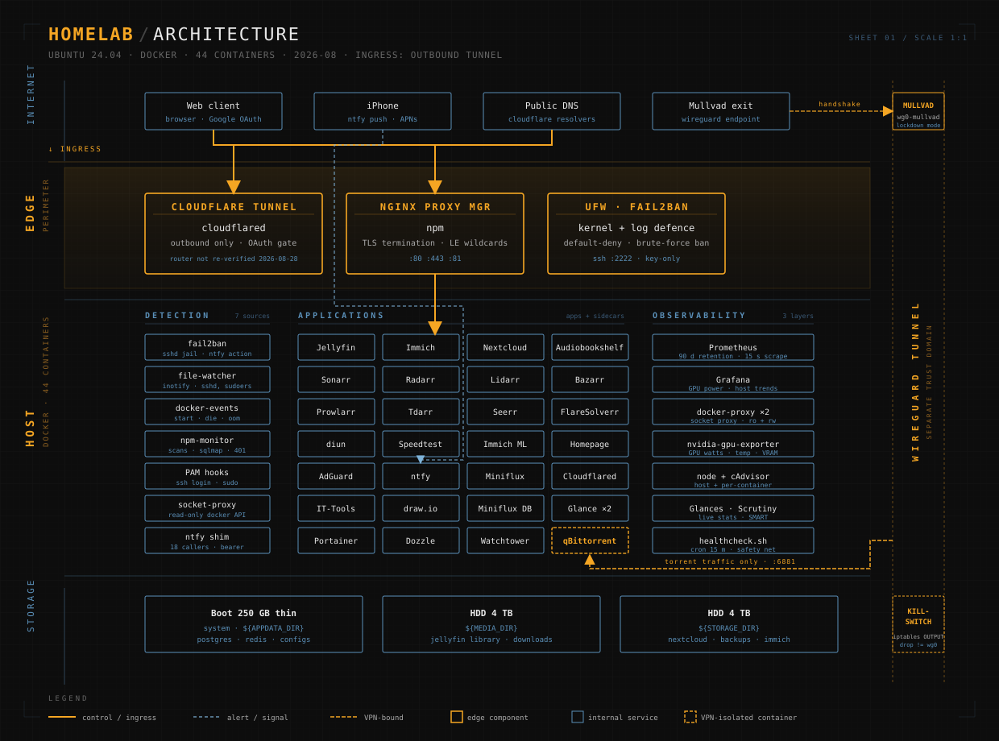
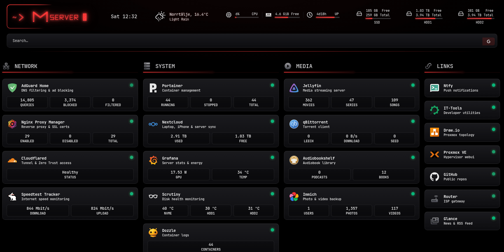
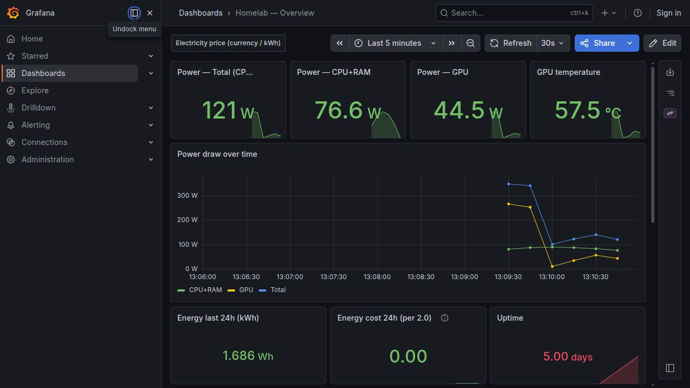

<div align="center">

# Homelab

**Sanitized reference of a real homelab: 44 Docker containers in one Proxmox VM, defense-in-depth, tunnel ingress.**

[](https://github.com/MrTorriz/homelab/actions/workflows/lint.yml)
[](LICENSE)
[](https://github.com/MrTorriz/homelab/commits/main)
[](docker/README.md)
[](docs/security.md)
[](https://github.com/MrTorriz/proxmox-homelab)
[](docs/hardware.md)
[](docker/README.md)

</div>

---

## TL;DR

- **Defense in depth** — UFW default-deny, fail2ban, `no-new-privileges` on every service, two-tier Docker socket proxy, Mullvad lockdown for the whole VM with a verified torrent killswitch.
- **Tunnel ingress** — external access rides an outbound Cloudflare Tunnel behind Google OAuth. Outbound Cloudflare Tunnel is the intended ingress path; the router port-forward table was not re-verified on 2026-08-28.
- **Three monitoring layers** — Prometheus/Grafana metrics, 18 ntfy callers (six event-driven), cron healthcheck (59 checks every 15 min).

### Verified snapshot — 2026-08-28

| | |
|---|---|
| Containers | 44 running / 0 unhealthy — `docker ps` |
| Guest OS | Ubuntu 24.04.4 · kernel 6.8.0-138 |
| Docker / Compose | 29.1.3 / 2.40.3 |
| GPU | RTX 2060 via vfio — NVENC (Jellyfin, Tdarr) + Immich ML |
| Storage | `/` 29 % · storage 73 % · media 90 % |
| Egress | Mullvad WireGuard, lockdown mode, verified exit |
| Hypervisor | Proxmox VE 8.4.21 → [proxmox-homelab](https://github.com/MrTorriz/proxmox-homelab) |

<sub>Read from the live system on the date above; nothing here updates automatically. What was and was not re-measured: <a href="docs/metrics.md">docs/metrics.md</a>.</sub>

---

<p align="center">
  
</p>

> **Runs virtualized.** This whole stack is the `docker-host` VM on a Proxmox host — the RTX 2060 and both HDDs are handed to it via passthrough. The hypervisor beneath this VM: **[proxmox-homelab](https://github.com/MrTorriz/proxmox-homelab)** (VM fleet, GPU/disk passthrough, fail-closed VPN gateway).

## What runs here

| Category | Services | Details |
|---|---|---|
| Reverse proxy & access | Nginx Proxy Manager, cloudflared | [docker/README.md](docker/README.md#service-catalogue) |
| Dashboards | Homepage, Glance ×2 | [homepage/](homepage/README.md) |
| Media | Jellyfin (NVENC), Sonarr, Radarr, Lidarr, Bazarr, Prowlarr, FlareSolverr, qBittorrent (VPN-bound), Tdarr, Seerr, Audiobookshelf | [docker/README.md](docker/README.md#service-catalogue) |
| Photos & files | Immich (server, ML, Postgres, Redis), Nextcloud (app, Postgres, Redis) | [docker/README.md](docker/README.md#immich-post-install-tuning) |
| DNS & network | AdGuard Home, Speedtest Tracker | [docs/architecture.md](docs/architecture.md) |
| Container management | Portainer, Dozzle, Watchtower, diun, docker-socket-proxy ×2 (ro + rw) | [docker/README.md](docker/README.md#conventions) |
| Observability | Prometheus, Grafana, node-exporter, nvidia-gpu-exporter, cAdvisor, Glances, Scrutiny | [docs/observability.md](docs/observability.md) |
| Notifications & reading | ntfy, Miniflux (+ Postgres) | [docs/observability.md](docs/observability.md#events-layer--18-ntfy-callers) |
| Utilities | IT-Tools, draw.io | [docker/README.md](docker/README.md#service-catalogue) |

43 services in `docker/compose.yml`; the 44th container on the live host is a personal service with a private image and is not published.

## Showcase

<p align="center">
  <br/>
  <sub><b>Homepage</b> — recording of the live dashboard (2026-08-29). DOM-only sanitization: Router description → <i>ISP gateway</i>, GitHub description → <i>Public repos</i>, and one private Links card removed; the MSERVER header and Norrtälje weather were deliberately retained. Still image: <a href="docs/img/homepage.png">homepage.png</a>.</sub>
</p>

<p align="center">
  <br/>
  <sub><b>Grafana</b> — rendered from the demo stack in <code>monitoring/demo/</code> with synthetic values; the host-power panels have been empty on the live system since 2026-07-04.</sub>
</p>

### Tooling demos

<p align="center">
  <br/>
  <sub><b>MOTD</b> — what an SSH login looks like</sub>
</p>

<p align="center">
  <br/>
  <sub><b>ntfy</b> — event-driven push alerts</sub>
</p>

<p align="center">
  <br/>
  <sub><b>killswitch check</b> — torrent egress vs host egress</sub>
</p>

<p align="center"><sub>Terminal demos rendered 2026-08-29 with <code>vhs</code> from <code>scripts/demo/</code>, all 2000 px wide at the same font size (2× for high-DPI screens), each cropped to its content. The MOTD is a fixed snapshot of a real login on 2026-08-29; ntfy and killswitch use synthetic values, and the Suricata event in the alerting demo is not deployed in the current VM.</sub></p>

> **What this is.** A sanitized public reference of a real, running homelab. The live configuration is the source of truth and lives in a private repository; this repo mirrors it with sensitive hostnames, domains and identifiers replaced, apart from the deliberate display-name exception below. It is not drop-in reproducible — paths, secrets and hardware assumptions belong to one specific box.
>
> **Sanitization policy.** RFC1918 addressing (`192.168.1.0/24`, `10.10.10.0/24`), the network topology and the host's display name *MSERVER* (dashboard logo, login banner) are published deliberately — they are unreachable from outside and carry no identity. The VM is called `docker-host` in the text. Domains, account names, MAC addresses, disk serials/WWNs, device identifiers, e-mail addresses and the ISP's name are replaced or removed.

---

## Repo layout

```text
.
├── docker/              # Compose stack (43 services; 44 containers live) + .env.example
├── homepage/            # Dashboard config (services + widgets) and the two Glance instances
├── scripts/             # healthcheck, backup/, security/, monitoring/, maintenance/, motd/, systemd/
├── security/            # UFW baseline, fail2ban, SSH, sysctl, hardening checklist, Suricata reference
├── monitoring/          # Prometheus scrape config, Grafana provisioning + dashboard, demo stack
├── docs/                # Architecture, security model, observability, metrics, runbook, DR, cost, decisions
└── .github/workflows/   # CI: shellcheck, yamllint, markdownlint, gitleaks, compose validation, link + fact checks
```

The repository's social preview is generated from [`docs/img/social-preview.svg`](docs/img/social-preview.svg) (rendered to [`social-preview.png`](docs/img/social-preview.png) with `rsvg-convert`); `docs/img/architecture.svg` is hand-edited in the same style.

## Reusing pieces

Nothing here is meant to be run as-is, but the parts are separable:

```bash
git clone https://github.com/MrTorriz/homelab.git ~/homelab
cd ~/homelab

# Compose stack — needs a filled-in .env and the paths/GPU it assumes
cp docker/.env.example docker/.env && $EDITOR docker/.env
docker network create homelab
(cd docker && docker compose config -q)      # validate before you run anything

# Firewall baseline (idempotent; review LAN_CIDR / ADMIN_IPS first)
sudo bash security/ufw-baseline.sh

# fail2ban jail + ntfy action
sudo cp security/fail2ban/jail.local /etc/fail2ban/jail.local && sudo cp security/fail2ban/action.d/ntfy.conf /etc/fail2ban/action.d/

# Cron + systemd units for the alerters
cat scripts/crontab.example; ls scripts/systemd/
```

> Set `LAN_IFACE` to match your NIC name — `eth0` is a placeholder; modern Ubuntu typically uses `enp*` or `ens*` (`ip -br link`).

External access is opt-in — set up a Cloudflare Tunnel and point it at `npm:443`; the tunnel is outbound-only, so it needs no inbound port on the router.

## Documentation

- [`docs/architecture.md`](docs/architecture.md) — How traffic, storage and trust flow through the VM
- [`docs/security.md`](docs/security.md) — Defense-in-depth model + STRIDE analysis
- [`docs/observability.md`](docs/observability.md) — Three layers: metrics (Prometheus + Grafana), events (18 ntfy callers), health (healthcheck cron)
- [`docs/metrics.md`](docs/metrics.md) — Snapshot 2026-08-28: what was re-measured, what was not
- [`docs/runbook.md`](docs/runbook.md) — Incident playbooks: what to do at 03:00
- [`docs/disaster-recovery.md`](docs/disaster-recovery.md) — RTO/RPO targets + restore procedure
- [`docs/cost.md`](docs/cost.md) — Historical cost breakdown (bare-metal era, April 2026)
- [`docs/hardware.md`](docs/hardware.md) — Specs, storage layout, GPU role
- [`docs/decisions.md`](docs/decisions.md) — Why these tools and not the alternatives
- [`SECURITY.md`](SECURITY.md) — How to report a sanitization miss

## License

MIT — fork it, copy bits, learn from it.
