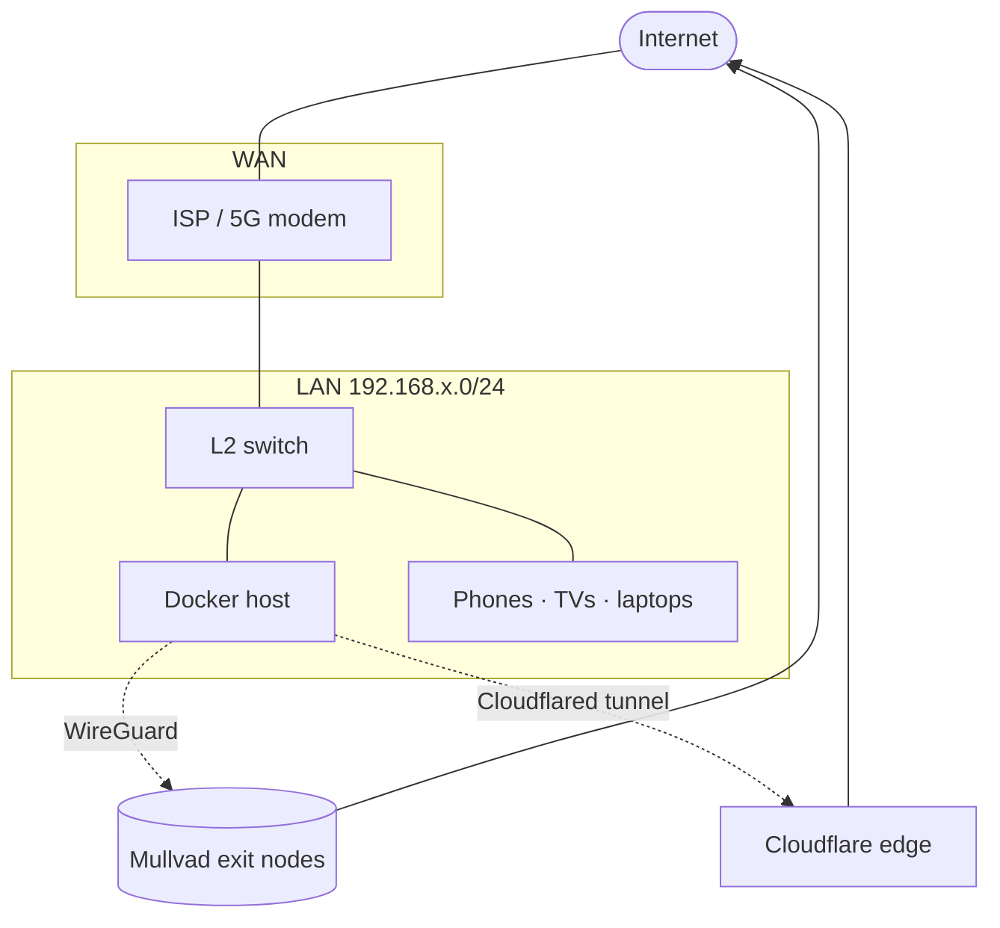
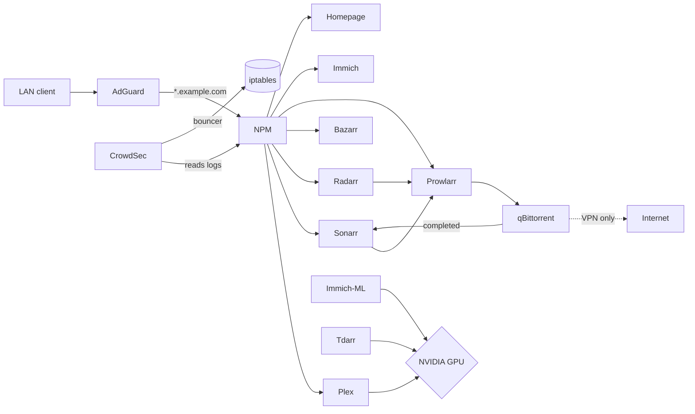
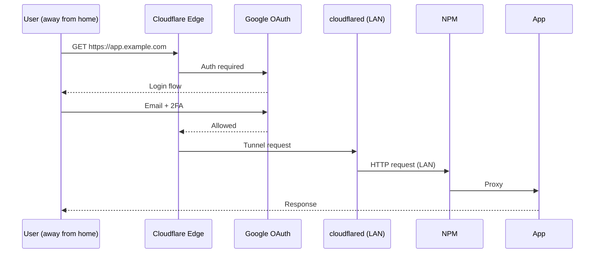

# Architecture

A single-host homelab with a strong perimeter, isolated egress for risky workloads, and a small but consistent set of internal abstractions.

## Network topology

**Key properties:**
- **Zero open inbound ports** at the router. External access goes through Cloudflare Tunnel + Google OAuth.
- **All LAN DNS** is intercepted by AdGuard Home (running on the host). The ISP-issued resolver is never used.
- **Risky egress** (torrent traffic) is locked to the WireGuard interface — if VPN drops, traffic stops (see `../security/vpn-killswitch.md`).

## Storage

Three logical tiers on the host:

| Mount | Type | Purpose |
|---|---|---|
| `/` | NVMe | OS, container runtime, ephemeral logs |
| `${APPDATA_DIR}` | NVMe | Container configs (persistent, small files, latency-sensitive) |
| `${MEDIA_DIR}` | HDD | Bulk media (movies, series, music, books) |
| `${STORAGE_DIR}` | HDD | Photos, downloads, transcoder cache, app data overflow |

Backups: nightly rsync of `${APPDATA_DIR}` → off-host destination, weekly verification job that lists files and compares sizes.

## Service interaction

## External access

No port forwarding. The home IP is never resolvable from public DNS.

## Why a single host

A multi-host setup would buy redundancy at the cost of operational surface area. For a homelab:

- One host means one OS to harden, one cron to maintain, one set of backups to verify.
- The host is well within capacity for the workload (CPU rarely above 30%, RAM usage steady, GPU only loaded during transcodes).
- Failure mode is acceptable: media is replaceable, photos are off-site backed up, *arr config is in `${APPDATA_DIR}` (backed up nightly).

If this ever needs HA, the cleanest path is replicating the host as a cold spare and rsync'ing `${APPDATA_DIR}` continuously — not adding orchestration layers.
