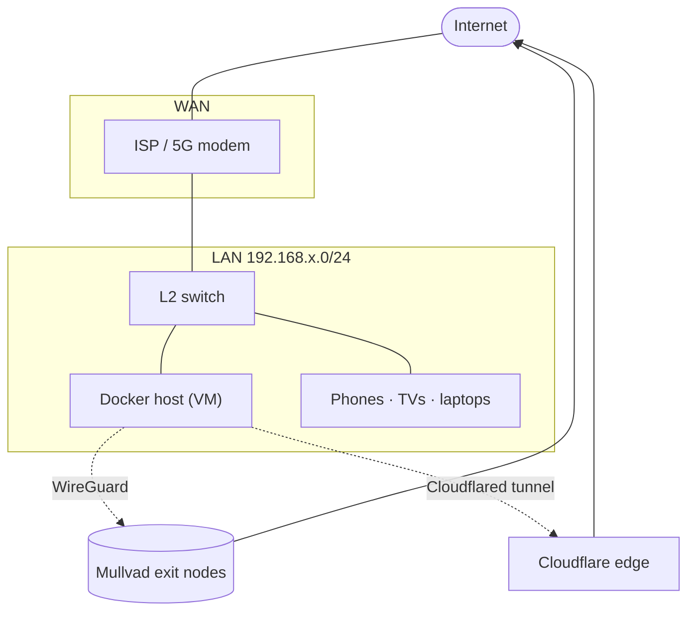
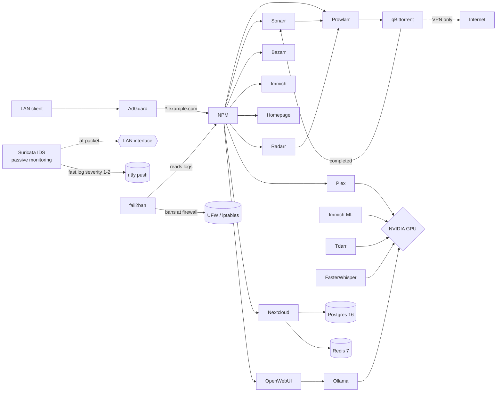
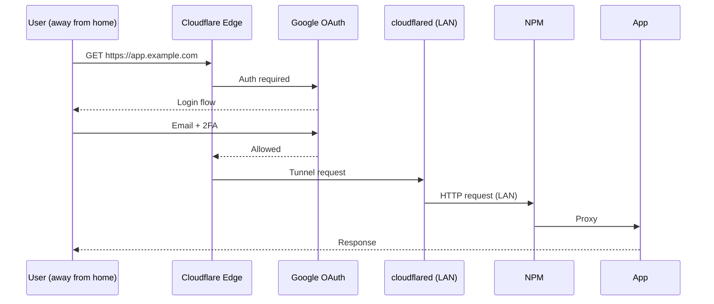

# Architecture

A single-host homelab with a strong perimeter, isolated egress for risky workloads, and a small but consistent set of internal abstractions. The stack runs inside one VM (`docker-host`) on a Proxmox host — the [virtualization layer](https://github.com/MrTorriz/proxmox-homelab) (VM fleet, GPU + whole-disk passthrough, VPN gateway) is documented separately; everything below is the view from inside that VM.

## Network topology

```mermaid
flowchart TB
    Internet([Internet])
    subgraph WAN
        ISP[ISP / 5G modem]
    end
    subgraph LAN[LAN 192.168.x.0/24]
        SW[L2 switch]
        Host["Docker host (VM)"]
        Clients[Phones · TVs · laptops]
    end

    Internet --- ISP --- SW
    SW --- Host
    SW --- Clients

    Host -. WireGuard .-> Mullvad[(Mullvad exit nodes)]
    Mullvad --> Internet

    Host -. Cloudflared tunnel .-> CF[Cloudflare edge]
    CF --> Internet
```

**Key properties:**
- **Zero open inbound ports** at the router. External access goes through Cloudflare Tunnel + Google OAuth.
- **All LAN DNS** is intercepted by AdGuard Home (running in the `docker-host` VM). The ISP-issued resolver is never used.
- **Risky egress** (torrent traffic) is locked to the WireGuard interface — if VPN drops, traffic stops (see `../security/vpn-killswitch.md`).

## Storage

Three logical tiers, as the VM sees them (the two HDDs are whole-disk passthrough from the Proxmox host):

| Mount | Type | Purpose |
|---|---|---|
| `/` | NVMe | OS, container runtime, ephemeral logs |
| `${APPDATA_DIR}` | NVMe | Container configs (persistent, small files, latency-sensitive) |
| `${MEDIA_DIR}` | HDD | Bulk media (movies, series, music, books) |
| `${STORAGE_DIR}` | HDD | Photos, downloads, transcoder cache, app data overflow |

Backups: nightly rsync of `${APPDATA_DIR}` → off-host destination, weekly verification job that lists files and compares sizes.

## Service interaction

```mermaid
flowchart LR
    User[LAN client] --> AdGuard
    AdGuard -->|*.example.com| NPM
    NPM --> Plex
    NPM --> Sonarr & Radarr & Bazarr & Prowlarr
    NPM --> Immich
    NPM --> Homepage

    Sonarr & Radarr --> Prowlarr --> qBittorrent
    qBittorrent -->|completed| Sonarr
    qBittorrent -.->|VPN only| Internet

    Plex --> NVENC{NVIDIA GPU}
    Immich-ML --> NVENC
    Tdarr --> NVENC
    FasterWhisper --> NVENC
    Ollama --> NVENC

    NPM --> Nextcloud
    NPM --> OpenWebUI
    OpenWebUI --> Ollama
    Nextcloud --> Postgres[(Postgres 16)]
    Nextcloud --> Redis[(Redis 7)]

    Suri[Suricata IDS<br/>passive monitoring] -.->|af-packet| LANIface{{LAN interface}}
    Suri -->|fast.log severity 1-2| ntfy[(ntfy push)]
    fail2ban -->|reads logs| NPM
    fail2ban -->|bans at firewall| UFW[(UFW / iptables)]
```

**Detection vs response, split:** `fail2ban` handles brute-force responses against SSH and NPM logs (it bans IPs). Suricata observes traffic on the LAN-facing interface in passive mode, raising alerts on exploit patterns, malware C2, scans, and policy violations — those go straight to push notification rather than auto-blocking. Inference and transcription workloads (Ollama, Open WebUI, Faster-Whisper) share the GPU with Plex transcoding and Immich ML; Nextcloud sits behind NPM with its own isolated Postgres and Redis.

## External access

```mermaid
sequenceDiagram
    participant U as User (away from home)
    participant CF as Cloudflare Edge
    participant OAuth as Google OAuth
    participant CFD as cloudflared (LAN)
    participant NPM
    participant App

    U->>CF: GET https://app.example.com
    CF->>OAuth: Auth required
    OAuth-->>U: Login flow
    U->>OAuth: Email + 2FA
    OAuth-->>CF: Allowed
    CF->>CFD: Tunnel request
    CFD->>NPM: HTTP request (LAN)
    NPM->>App: Proxy
    App-->>U: Response
```

No port forwarding. The home IP is never resolvable from public DNS.

## Why a single host

A multi-host setup would buy redundancy at the cost of operational surface area. For a homelab:

- One box means a small surface: the workload is a single VM to harden, one cron to maintain, one set of backups to verify — the hypervisor beneath it is deliberately minimal ([proxmox-homelab](https://github.com/MrTorriz/proxmox-homelab)).
- The host is well within capacity for the workload (CPU rarely above 30%, RAM usage steady, GPU only loaded during transcodes).
- Failure mode is acceptable: media is replaceable, photos are off-site backed up, *arr config is in `${APPDATA_DIR}` (backed up nightly).

If this ever needs HA, the cleanest path is replicating the host as a cold spare and rsync'ing `${APPDATA_DIR}` continuously — not adding orchestration layers.
