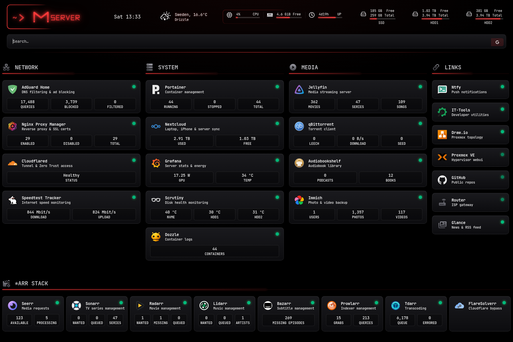

# Homepage configuration

[Homepage](https://gethomepage.dev) is the entry-point dashboard. Service tiles are auto-populated from the running Docker containers (via the read-only `docker-socket-proxy` on the `socket-ro` network).

  
   
  Homepage — sanitized live capture (2026-08-29). Browser chrome, internal addresses, the precise weather location and one private Links card were removed or generalized; the MSERVER display name was deliberately retained.

## Files

| File | Purpose |
|---|---|
| `services.yaml` | Service tiles, grouped by row → group (mirrors live as of 2026-08-28) |
| `widgets.yaml` | Header widgets: greeting, clock, weather, CPU/mem/uptime, three disks, search |
| `glance/` | Config for the two Glance start-page instances |

## Setup

1. Copy `services.yaml` and `widgets.yaml` to `${APPDATA_DIR}/homepage/`
2. Copy the contents of `glance/` to `${APPDATA_DIR}/glance/`
3. Replace `example.com` with your domain and `${LAN_IP}` with the host address
4. For widget API keys (Sonarr/Radarr/Jellyfin…), set `HOMEPAGE_VAR_SONARR_KEY=...` etc. in Homepage's own `.env`
5. The Scrutiny widget keys devices by NVMe serial / SATA WWN — fill in the `<nvme-serial>` / `<hdd-wwn-*>` placeholders from your `/api/summary`
6. Restart the dashboard containers

## Layout

Two rows, grouped by mental model rather than alphabetically:

- **Row 1 — Network · System · Media · Links:** what keeps the lights on (DNS, proxy, tunnel, speedtest), the box itself (Portainer, Nextcloud storage, Grafana GPU, Scrutiny disk temps, Dozzle container count), what gets consumed (Jellyfin, qBittorrent, Audiobookshelf, Immich), and the shortcuts (ntfy, IT-Tools, draw.io, Proxmox, GitHub, router, Glance)
- **Row 2 — *arr stack:** Seerr, Sonarr, Radarr, Lidarr, Bazarr, Prowlarr, Tdarr, FlareSolverr, full width

Group order matches how often I look at them. Most-checked groups come first in each row.
