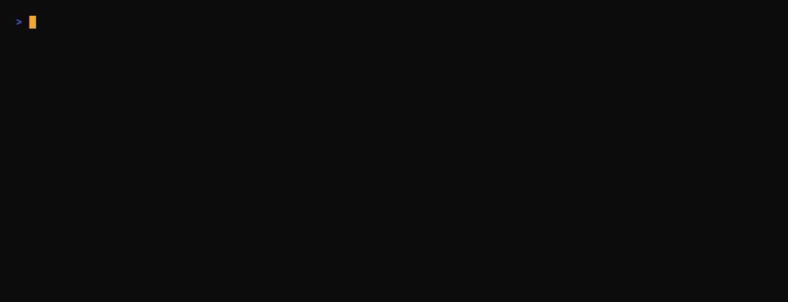
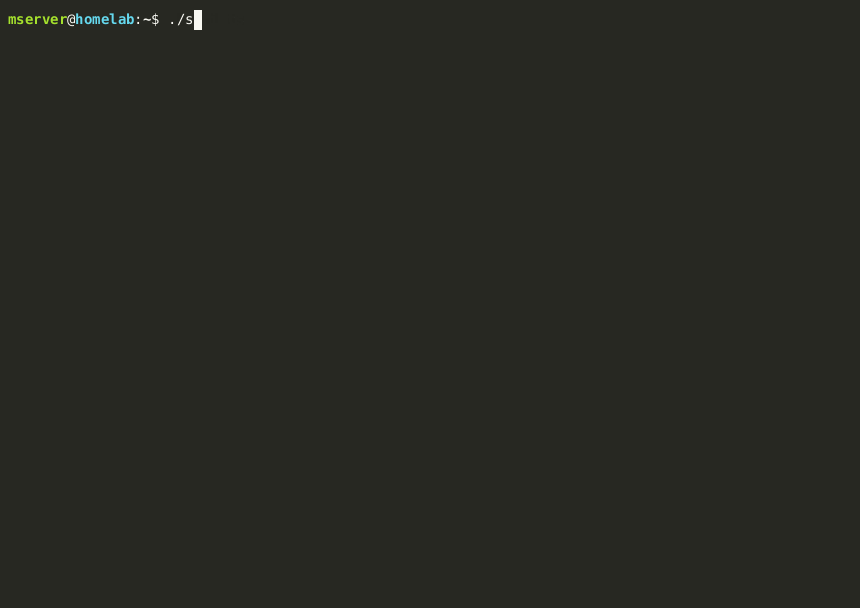

# Scripts

Small bash utilities that keep the homelab honest. All source `lib.sh` for shared helpers (ntfy notifications, log rotation).

| Script | Purpose | Schedule |
|---|---|---|
| `deploy.sh` | Idempotent rsync from git → live, with conditional service reloads | On every commit (or `git pull` post-merge hook) |
| `healthcheck.sh` | Verify containers, VPN, external hostnames, disk usage | every 15 min |
| `vpn-killswitch-check.sh` | Confirm torrent traffic is confined to the VPN interface | every 30 min |
| `mullvad-rotate.sh` | Rotate Mullvad exit IP through a country list | every 6 hours |
| `lib.sh` | Shared functions (`ntfy_send`, `ntfy_url`, `log_rotate`) | sourced |

## What it looks like

`deploy.sh` only touches services whose source files actually changed — and only reloads the ones that need it:

<p align="center">
  
</p>

`healthcheck.sh` is the periodic safety net — if anything is unhealthy, ntfy fires:

<p align="center">
  
</p>

## Subdirectories

Heavier automation lives one level deeper, grouped by intent:

| Directory | What's in it |
|---|---|
| `backup/` | Daily appdata snapshot, weekly verify, encrypted offsite push via rclone |
| `security/` | Aggregated read-only audit (`security-check.sh` + lib), weekly digest, cert expiry, virus scan, UFW summary |
| `monitoring/` | Temperature watch, restart-loop alerter, real-time docker event watcher (systemd), Homepage stats generator |
| `maintenance/` | Docker prune, log hygiene, weekly health report, storage report |
| `motd/` | `server-status.sh` — drop into `/etc/update-motd.d/` for the SSH banner |

Each subdirectory holds standalone scripts that source `../lib.sh`. Read the header comment at the top of any script for required env vars.

The full schedule that ties these together lives in [`crontab.example`](crontab.example).

## Conventions

- `set -euo pipefail` everywhere
- Every script accepts environment overrides for paths (e.g. `LIVE_DOCKER`, `NTFY_TOPIC`, `LOG_DIR`, `BACKUP_DIR`)
- Push notifications go through ntfy — no email, no Slack
- Logs land in `~/logs/` and self-rotate via `log_rotate`

## Suggested cron

A complete example with comments lives in [`crontab.example`](crontab.example). The minimum to get useful coverage:

```cron
*/15 *  * * *   $HOME/scripts/healthcheck.sh
*/30 *  * * *   $HOME/scripts/vpn-killswitch-check.sh
0    */6 * * *  $HOME/scripts/mullvad-rotate.sh
```

## Why bash and not Python/Go

For these jobs, bash is the right tool: short, no runtime to install, easy to read in a terminal six months later. The only thing that would justify a switch is if any single script grew past ~150 lines or needed structured data handling — at which point it should be rewritten, not patched.
