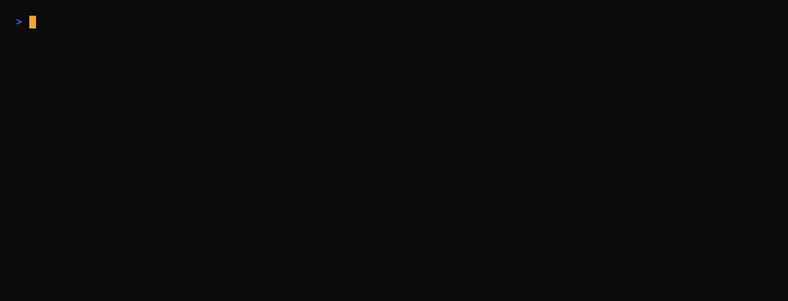

# Security

The defense-in-depth pieces of the homelab.

| File | Purpose |
|---|---|
| `ufw-baseline.sh` | Apply default-deny UFW with a minimal allowlist |
| `fail2ban/jail.local` | SSH brute-force protection (Suricata covers post-perimeter behavioural detection) |
| `ssh/sshd_config` | Hardened SSH: keys-only, strong crypto, explicit user allowlist |
| `suricata/` | Passive IDS — config example + ntfy alert flow |
| `sysctl.d/99-homelab.conf` | Kernel tuning (swappiness + commented optionals) |
| `hardening-checklist.md` | Copy-and-work-through list for any new Ubuntu host |
| `vpn-killswitch.md` | How torrent traffic is bound to the VPN interface, with verification |

## VPN killswitch in action

`vpn-killswitch-check.sh` resolves the torrent client's egress IP, asserts it's the Mullvad exit and not the ISP, and refuses to exit zero if the rule isn't loaded:

  

See [`../docs/security.md`](../docs/security.md) for the full threat model and layer-by-layer reasoning.
